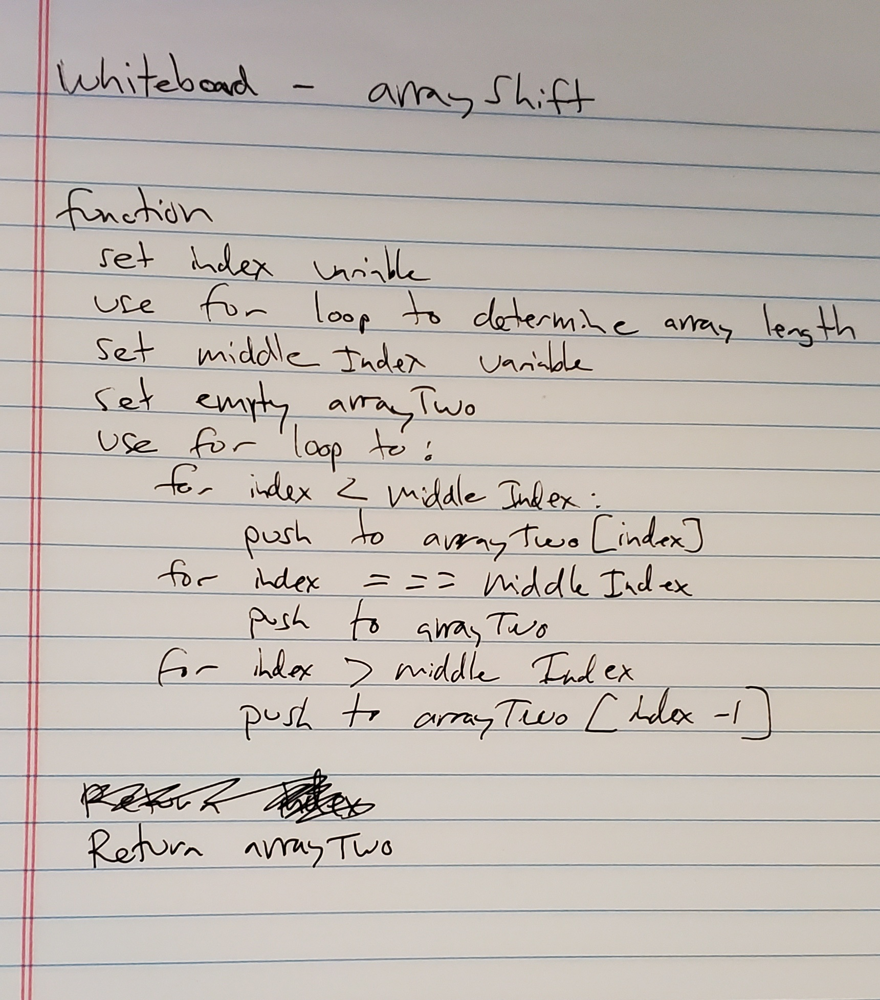

# Data Structures and Algorithms

See [setup instructions](https://codefellows.github.io/setup-guide/code-301/3-code-challenges), in the Code 301 Setup Guide.

## Repository Quick Tour and Usage

### 301 Code Challenges

Under the `data-structures-and-algorithms` repository, at the top level is a folder called `code-challenges`

Each day, you'll add one new file to this folder to do your work for the day's assigned code challenge

### 401 Data Structures, Code Challenges

# Challenge 01 - Array Shift
## Challenge Summary
Write a function called insertShiftArray which takes in an array and the value to be added. Without utilizing any of the built-in methods available to your language, return an array with the new value added at the middle index.

## Challenge Description
Write a function called insertShiftArray which takes in an array and the value to be added. Without utilizing any of the built-in methods available to your language, return an array with the new value added at the middle index..

## Approach & Efficiency
I took the approach of getting the middle index, then using a for loop with if/else if syntax to push numbers from the original array as well as the provided variable number into the new array at appropriate places.

## Solution

