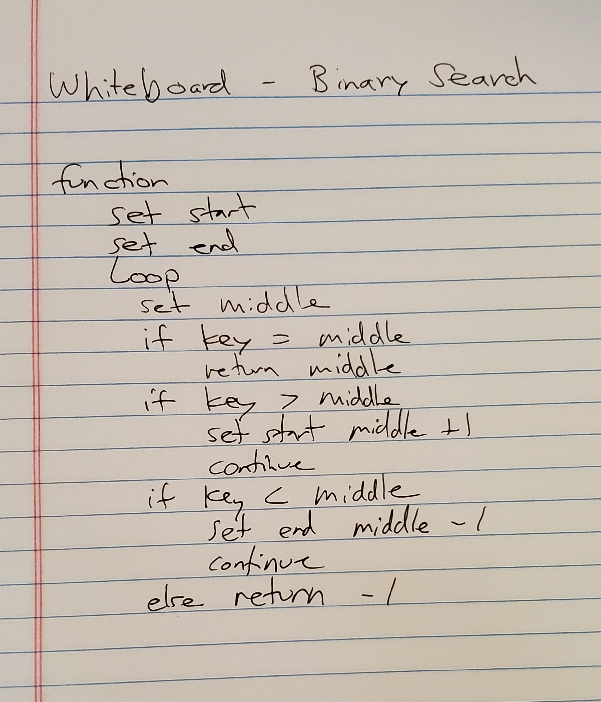

# Data Structures and Algorithms

See [setup instructions](https://codefellows.github.io/setup-guide/code-301/3-code-challenges), in the Code 301 Setup Guide.

## Repository Quick Tour and Usage

### 301 Code Challenges

Under the `data-structures-and-algorithms` repository, at the top level is a folder called `code-challenges`

Each day, you'll add one new file to this folder to do your work for the day's assigned code challenge

### 401 Data Structures, Code Challenges

//=============================================================================================\\

# Challenge 03 - Array Shift

## Challenge Summary
Write a function called insertShiftArray which takes in an array and the value to be added. Without utilizing any of the built-in methods available to your language, return an array with the new value added at the middle index.

## Challenge Description
Write a function called insertShiftArray which takes in an array and the value to be added. Without utilizing any of the built-in methods available to your language, return an array with the new value added at the middle index..

## Approach & Efficiency
I took the approach of getting the middle index, then using a for loop with if/else if syntax to push numbers from the original array as well as the provided variable number into the new array at appropriate places.

## Solution

//===========================================================================================\\

# Challenge 04 - Array Binary Search

## Challenge Summary
Write a function called BinarySearch which takes in 2 parameters: a sorted array and the search key. Without utilizing any of the built-in methods available to your language, return the index of the array’s element that is equal to the search key, or -1 if the element does not exist.

## Challenge Description
The search algorithm used in your function should be a binary search.

## Approach & Efficiency
I wrote a function that sets the start and end of the array, then uses a while loop that takes the middle value, then determines if the key is greater or less than this middle value. if greater, we essentially cut the array in half, and run the same loop on the greater half of the array. If the key is smaller, we essentially cut the array down to the loower half and run it on that. We repeat this until we arrive at a place where key === middle value.

## Solution

//======================================================================================\\

# Challenge 05 - Linked List

## Challenge Summary
Define a method called insert which takes any value as an argument and adds a new node with that value to the head of the list with an O(1) Time performance.

Define a method called includes which takes any value as an argument and returns a boolean result depending on whether that value exists as a Node’s value somewhere within the list.

Define a method called toString which takes in no arguments and returns a string representing all the values in the Linked List, formatted as: "{ a } -> { b } -> { c } -> NULL".

## Approach & Efficiency
Methods were written within a linked list class (LL) to perform the linked list actions insert, includes() and toString. To perform these tasks, we used loops to traverse the linked list, doing the appropriate "thing" to the data, then returning the data.

## API

**Insert - pseudo code:**
Create a node
If head does not exist, set node to head
If head does exist, let the current node be the head
Traverse the linked list with while loop
When traverse is complete (current.next = NULL),
  set current.next = node we created at start of function

**Includes(value) - psuedo code:**
set node to head
while more nodes exist:
  if current node value = value
    return true
    otherwise move to the next node
if while loop fails to find value; return false

**toString - pseudo code:**

set node to head
set result equal to empty string
while nodes exist:
  add node value to result string
  or, if node.next = NULL (no more nodes in list), add NULL to result list
  move to next node
return result string

//================================================================================\\
  
# Challenge 06 - Linked List Insertions

## Challenge Summary

Write Functions that:

.append(value) which adds a new node with the given value to the end of the list

.insertBefore(value, newVal) which add a new node with the given newValue immediately before the first value node

.insertAfter(value, newVal) which add a new node with the given newValue immediately after the first value node

## Approach & Efficiency
Methods were written within a linked list class (LL) to perform the linked list actions append, insertBefore, insertAfter. To perform these tasks, we used loops to traverse the linked list, doing the appropriate "thing" to the data, then returning the data.

## API

**append - pseudo code:**
create new node
if list does not have head, set node to head
otherwise traverse the linked list
when reaching the end (!current.next):
  set currrent.next = node

**insertBefore(value, newVal) - pseudo code:**
create new node
if list does not have head, set node to head
otherwise traverse the linked list
if currrent node value = value
  set current to new node.next
continue traversing list
return list

**insertAfter(value, newVal) - pseudo code:**
create new node
if list does not have head, set node to head
otherwise traverse the linked list
if current node value = value
  set current.next to new node
continue traversing list
return list

//================================================================================\\
  
# Challenge 07 - k from end of list

## Challenge Summary

Write a method for the Linked List class which takes a number, k, as a parameter. Return the node’s value that is k from the end of the linked list. You have access to the Node class and all the properties on the Linked List class as well as the methods created in previous challenges.

## Approach & Efficiency

Methods were written within a linked list class (LL) to perform the linked list actions append, insertBefore, insertAfter. To perform these tasks, we used loops to traverse the linked list, doing the appropriate "thing" to the data, then returning the data. In this case, we need to traverse the list twice to 1) get the total count of the list, and 2) to get the count from the start as total count - k.

## API

**k from end of list - pseudo code:**
set head of list
initialize total count to 0
traverse list
  get total count by increasing count by 1 with each node
set countFromStart = total count - k value
initialize result variable
set head of list again
initialize count2 to 0
traverse list again
  increase count2 by one with each node
  if countFromStart + 1 = count2
    return current node value
  contiinue to traverse list
return result

//================================================================================\\
  
# Challenge 08 - Zipped List

## Challenge Summary

Write a function called zipLists which takes two linked lists as arguments. Zip the two linked lists together into one so that the nodes alternate between the two lists and return a reference to the head of the zipped list. Try and keep additional space down to O(1). You have access to the Node class and all the properties on the Linked List class as well as the methods created in previous challenges.

## Approach & Efficiency

The zipLists() function was written as a method of the linked list class (LL), which also includes methods for append, insertBefore, insertAfter, toString, and kFromEnd. To perform the desired task, we use a while loop to traverse the linked list, doing the appropriate "thing" to the data, then returning the data. In this case, we are simultaneously traversing two linked lists

## API

**zipped list - pseudo code:**

instantiate new "zipped list"

set head of list 1

set head of list 2

while list 1 or list 2 has nodes:

  if list 1 has a node

    append node value to zipped list

    continue to next node

  if list 2 has a node

    append node value to zipped list

    continue to next node

return zipped list
  

//================================================================================\\
  
# Challenge 10 - Stacks and Queues

## Challenge Summary

Create a Node class that has properties for the value stored in the Node, and a pointer to the next node.

Create a Stack class that has a top property. It creates an empty Stack when instantiated. This object should be aware of a default empty value assigned to top when the stack is created.

Define a method called push which takes any value as an argument and adds a new node with that value to the top of the stack with an O(1) Time performance.

Define a method called pop that does not take any argument, removes the node from the top of the stack, and returns the node’s value. Should raise exception when called on empty stack.

Define a method called peek that does not take an argument and returns the value of the node located on top of the stack, without removing it from the stack. Should raise exception when called on empty stack.

Define a method called isEmpty that takes no argument, and returns a boolean indicating whether or not the stack is empty.

Create a Queue class that has a front property. It creates an empty Queue when instantiated. This object should be aware of a default empty value assigned to front when the queue is created.

Define a method called enqueue which takes any value as an argument and adds a new node with that value to the back of the queue with an O(1) Time performance.

Define a method called dequeue that does not take any argument, removes the node from the front of the queue, and returns the node’s value. Should raise exception when called on empty queue.

Define a method called peek that does not take an argument and returns the value of the node located in the front of the queue, without removing it from the queue. Should raise exception when called on empty queue.

Define a method called isEmpty that takes no argument, and returns a boolean indicating whether or not the queue is empty.

## Approach & Efficiency

Methods were written inside of Stack and Queue classes inside stacks.js and queue.js. Inside both of these classes, we have a constructor that instantiates a new stack or queue with the appropriate references (top for stack, front and rear for queue). We utilize temp nodes to retrieve values as needed, and use reassigning of front, rear, or top and next (for stacks) to perform the desired actions.

## File Architecture

Stacks and Queues
├── __test__
│   └── stacks-and-queues.test.js
├── index.js
├── lib
│   ├── node.js
│   ├── queue.js
│   └── stacks.js
└── package.json

## API

**Stacks - pseudo code:**

**Push**

Instantiate new node(value)

if top is null, set node to top and increase length, else:

  node.next = top

  top = node

  increase length

**Pop**

if stack is empty, return null. Else:

  temp = top

  top = top.next

  temp.next = null

  decrease length

  return temp

**Peek**

if stack is empty, return null. else:

  return value of top node

**Queues - psuedo code:**

**Enqueue**

instantiate new node

if queue has no front:

  front = new node

  rear = new node

else:

  rear.next = node

  rear = node

  increase length

**Dequeue**

if queue is empty, return null.

Else:

  temp = front

  front = front.next

  temp.next = null

  decrese length

  return temp

**Peek**

if queue is empty, return null.

Else:

  return front.value
