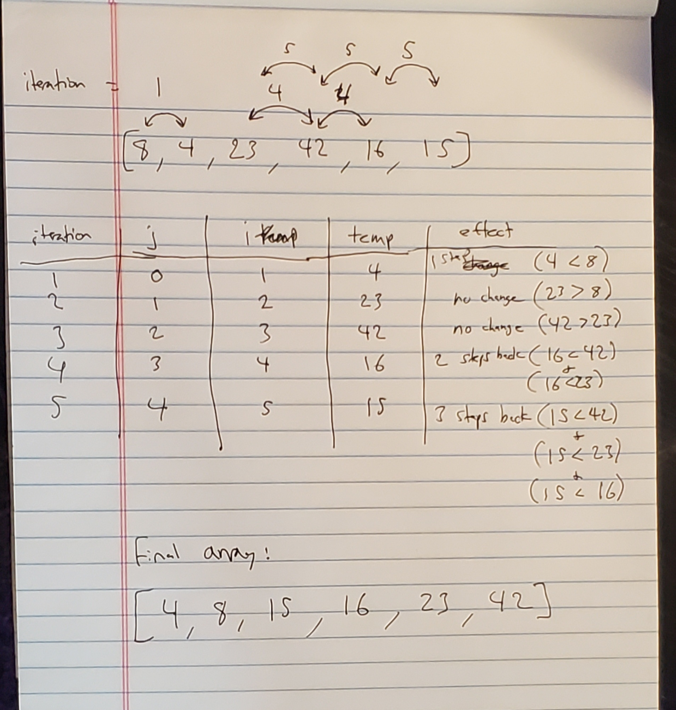

# Insertion-Sort

## Psuedo-Code

```  
InsertionSort(int[] arr)
  
    FOR i = 1 to arr.length
    
      int j <-- i - 1
      int temp <-- arr[i]
      
      WHILE j >= 0 AND temp < arr[j]
        arr[j + 1] <-- arr[j]
        j <-- j - 1
        
      arr[j + 1] <-- temp
```

## Trace and Step-Thru

First, we run a for loop from index position 1 through the end of the array. Within the loop, we declare variable "j" as ```i - 1```. Note that this is not arr[i - 1], so this variable is not the value, but the previous index value from the one we are at in the loop. We also make a variable "temp" which is set to the value of arr[i]. 

We then enter a while loop that runs while j is non-zero, and temp (arr[i]) is less than arr[j] - which means we essentially compare the values of j and i to each other, and if the previous number (j) is greater than the current (i), we assign the value of arr[j] to the value of arr[j + 1], and then immediately reassign the value of j back to the previous value in the comparison so we can continue to compare.

Lastly, we reassign temp to ass[j + 1], which sets up the two variables i and j to make the next comparison in the list.

In summary, we loop through the array, comparing each two values and inserting the greater value further along in the array. After the looping completes its run through the entire array, the effect is we will have an array sorted from least to greatest.

