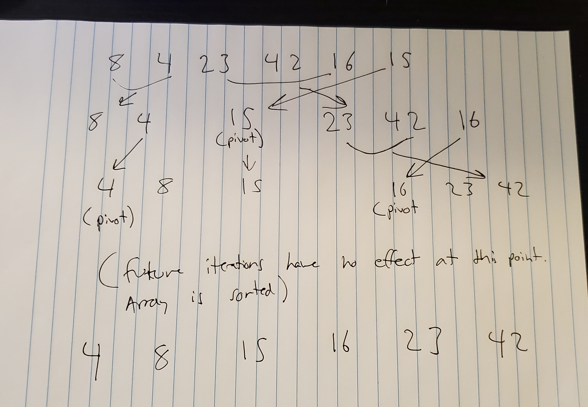

# Merge-Sort

## Psuedo-Code

```  
ALGORITHM QuickSort(arr, left, right)
    if left < right
        // Partition the array by setting the position of the pivot value 
        DEFINE position <-- Partition(arr, left, right)
        // Sort the left
        QuickSort(arr, left, position - 1)
        // Sort the right
        QuickSort(arr, position + 1, right)

ALGORITHM Partition(arr, left, right)
    // set a pivot value as a point of reference
    DEFINE pivot <-- arr[right]
    // create a variable to track the largest index of numbers lower than the defined pivot
    DEFINE low <-- left - 1
    for i <- left to right do
        if arr[i] <= pivot
            low++
            Swap(arr, i, low)

     // place the value of the pivot location in the middle.
     // all numbers smaller than the pivot are on the left, larger on the right. 
     Swap(arr, right, low + 1)
    // return the pivot index point
     return low + 1

ALGORITHM Swap(arr, i, low)
    DEFINE temp;
    temp <-- arr[i]
    arr[i] <-- arr[low]
    arr[low] <-- temp
```

## Trace and Step-Thru

**quickSort(arr, left, right)**

This is an algorithm that takes in an array, and a left and right value. First we do the following IF left is less than right:

We set a variable "position" equal to the return of calling the partition() function, then recursively call quickSort() twice to sort the left and right sides.

**partition(arr, left, right)**

Here we set variable pivot equal to arr[right]. We then define a "low" variable to track the largest index of numbers lower than the defined pivot. This variable is set equal to left-1. We then enter a for loop for i between the indexes of left and right, wherein if arr[i] <= pivot, we increment the "low" variable, and swap arr[i] with arr[low]. Outside the loop, we swap arr[right] with arr[low + 1]. We return low + 1

**swap(arr, i, low)**

We set a variable temp, and set it equal to arr[i]. We then set arr[i] equal to arr[low]. Then we set arr[low] eual to temp.



